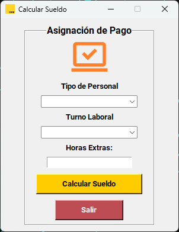
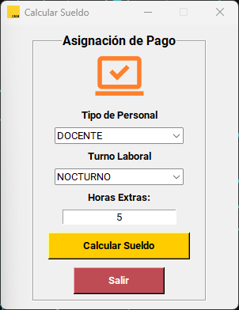
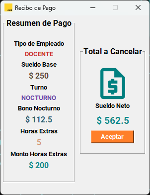

# Calculadora de Sueldo
Este es un proyecto básico de una **App** en Python3 haciendo uso de la biblioteca **TK** para GUI, el objetivo es hacer el cálculo del sueldo neto de un empleado público en el área de educación.
## Características
- Determina si no le suministran los datos correctamente
- Realiza el cálculo de las bonificaciones por tipo de turno
- Calcula las asignaciones por Horas Extras
- Generar un Balance General del Sueldo Neto

## Imágenes

### Autor
[César Grisel](mailto:griselcesar@gmail.com)

**Teléfono:** +58426-696.32.80

Hecho en *Maturín*